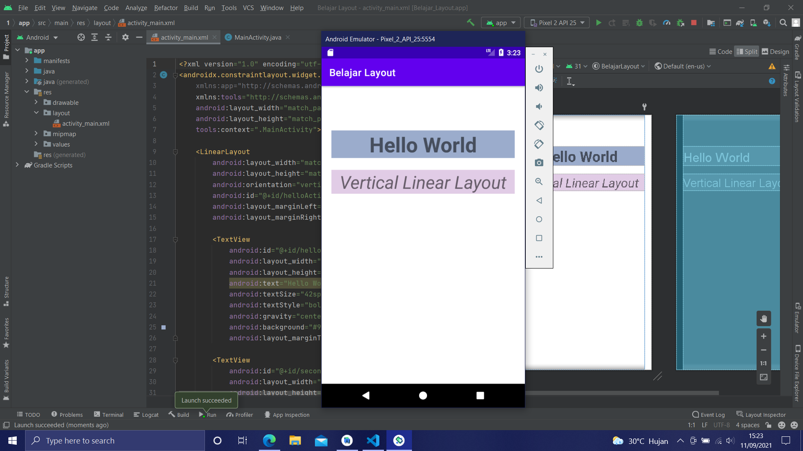

# 01 Linear Layout - Hello World

## Tujuan Pembelajaran

1. Mahasiswa akan membuat halaman login sederhana menggunakan LinearLayout. Pertama kita belajar membuat hello-world dengan TextView pada Linear Layout.

## Hasil Praktikum

### Tampilan dari praktikum

Link menuju sumber : [Source](/../../tree/master/src/01%20Linear%20Layout%20-%20Hello%20World)