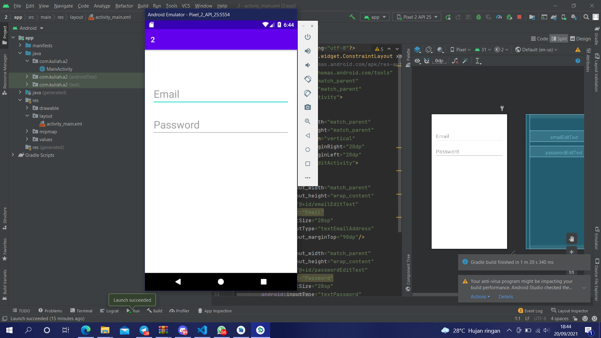

# 02 Linear Layout - Email & Password

## Tujuan Pembelajaran

1. Mahasiswa mengetahui cara membuat komponen yang dapat menerima masukan dari pengguna dengan menggunakan EditText. Ini adalah dasar untuk membuat halaman yang membutuhkan masukan dari pengguna, seperti halaman login.

## Hasil Praktikum

Link menuju sumber : [Source](/../../tree/master/src/02$20Linear$20Layout$20-$20Email$20&$20Password)