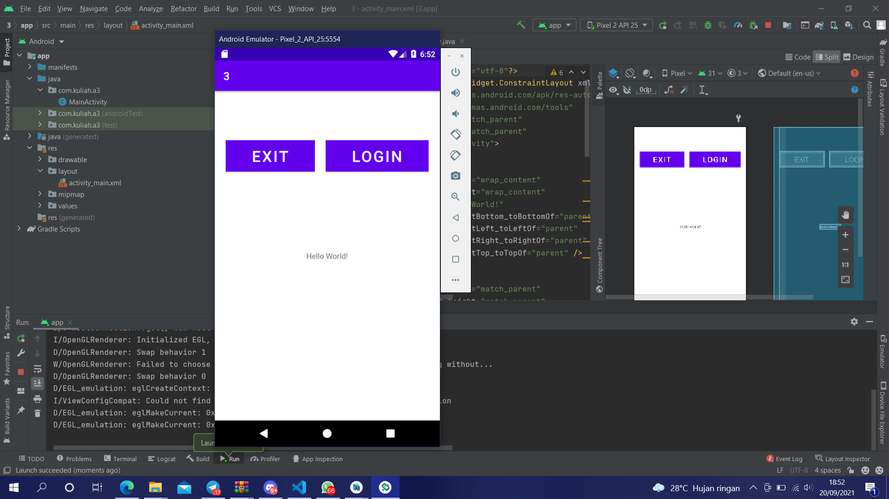

# 03 Linear Layout - Exit & Login Button

## Tujuan Pembelajaran

1. Mahasiswa akan belajar bagaimana cara membuat tombol sederhana untuk aksi pengguna. Tombol exit untuk keluar dari halaman dan tombol login untuk melakukan login. Mari kita coba menggunakan horizontal linear layout.

## Hasil Praktikum

Link menuju sumber : [Source](/../../tree/master/src/03$20Linear$20Layout$20-$20Exit$20&$20Login$20Button)