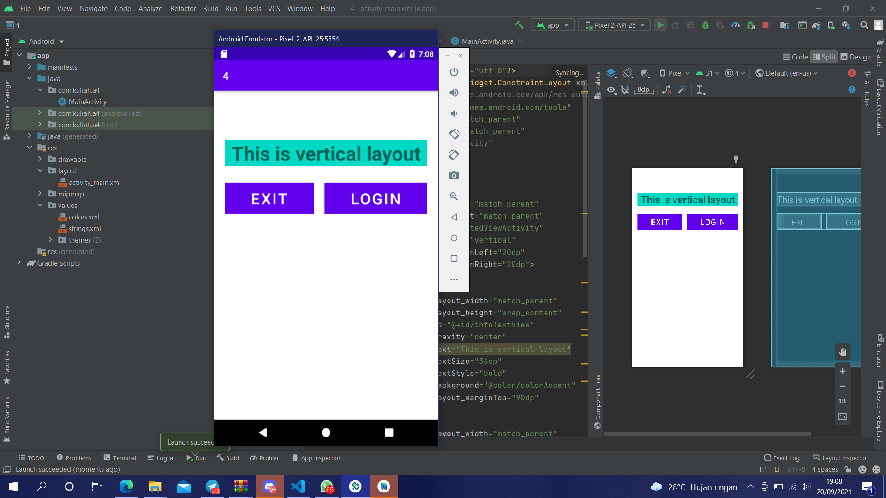

# 04 Linear Layout - Nested View

## Tujuan Pembelajaran

1. Mahasisiwa mampu membuat komponen bersarang, horizontal linear layout pada vertikal linear layout.

## Hasil Praktikum

Link menuju sumber : [Source](/../../tree/master/src/04$20Linear$20Layout$20-$20Nested$20View)