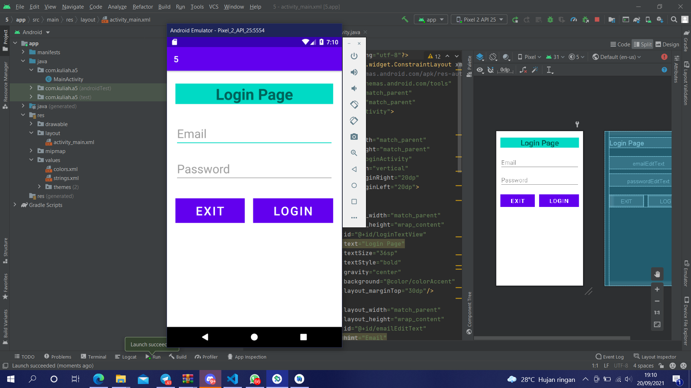

# 05 Linear Layout - Simple Login Page

## Tujuan Pembelajaran

1. Siswa akan membuat halaman login sederhana berdasarkan materi yang telah dipelajari sebelumnya. Dalam topik terakhir tentang linear layout ini, akan terlihat jelas apa yang telah kita pelajari.

## Hasil Praktikum

Link menuju sumber : [Source](/../../tree/master/src/05$20Linear$20Layout$20-$20Simple$20Login$20Page)