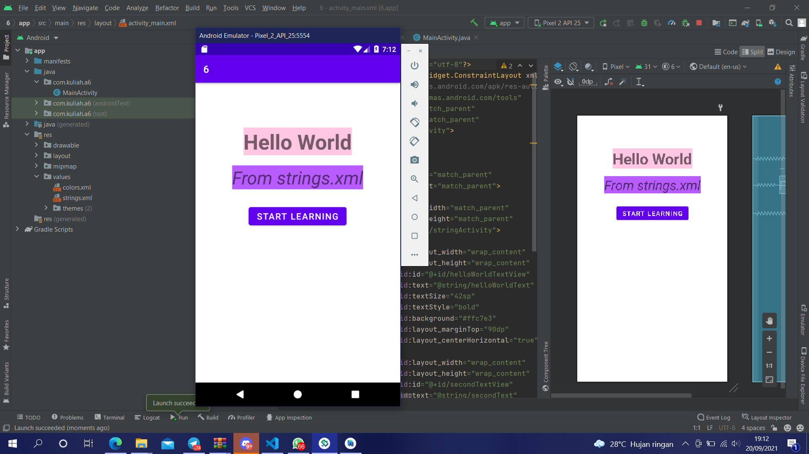

# 06 Relative Layout - String.xml

## Tujuan Pembelajaran

1. Mahasiswa mengetahui bagaimana cara menggunakan sumber daya string untuk teks sebuah komponen.

## Hasil Praktikum

Link menuju sumber : [Source](/../../tree/master/src/06$20Relative$20Layout$20-$20String.xml)