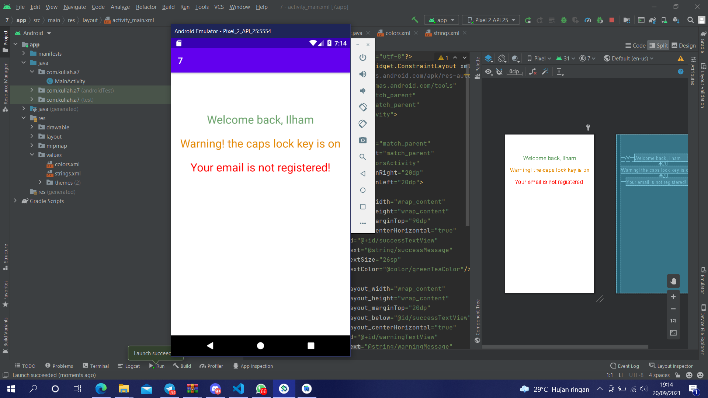

# 07 Relative Layout - Colors.xml

## Tujuan Pembelajaran

1. Mahasiswa mengetahui cara menggunakan sumber daya string dan warna untuk textview.

## Hasil Praktikum

Link menuju sumber : [Source](/../../tree/master/src/07$20Relative$20Layout$20-$20Colors.xml)