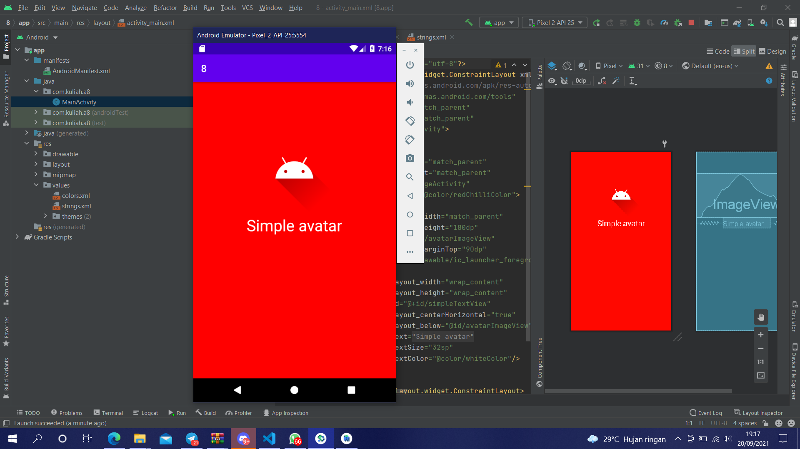

# 08 Relative Layout - ImageView

## Tujuan Pembelajaran

1. Mahasiswa mengetahui cara menampilkan gambar menggunakan imageview.

## Hasil Praktikum

Link menuju sumber : [Source](/../../tree/master/src/08$20Relative$20Layout$20-$20ImageView)