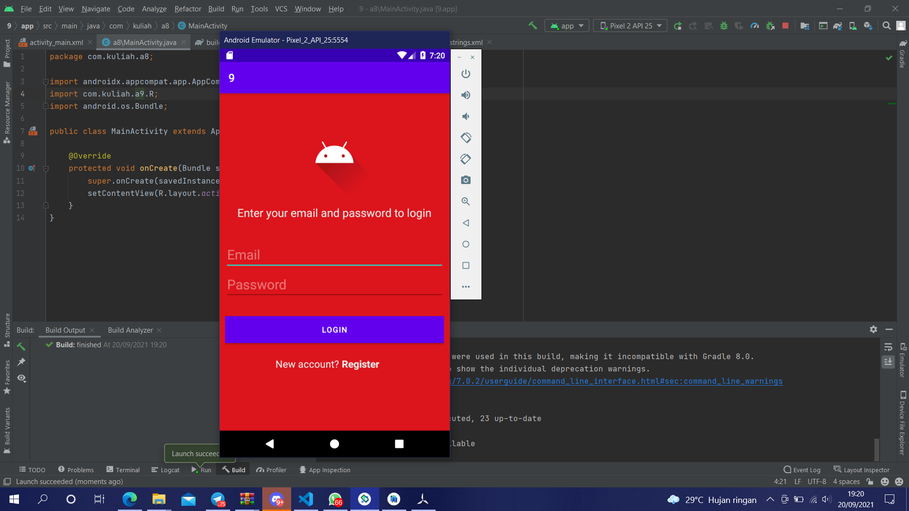

# 09 Relative Layout - Modern Login UI

## Tujuan Pembelajaran

1. Mahasiswa mengetahui cara membuat sebuah tampilan antarmuka login yang modern dengan relative layout.

## Hasil Praktikum

Link menuju sumber : [Source](/../../tree/master/src/09$20Relative$20Layout$20-$20Modern$20Login$20UI)