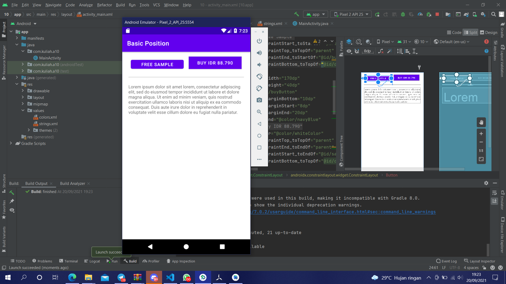

# 10 Constraint Layout - Basic View Position

## Tujuan Pembelajaran

1. Mahasiswa tahu bagaimana mengatur view dalam constraint layout.

## Hasil Praktikum

Link menuju sumber : [Source](/../../tree/master/src/10$20Constraint$20Layout$20-$20Basic$20View$20Position)