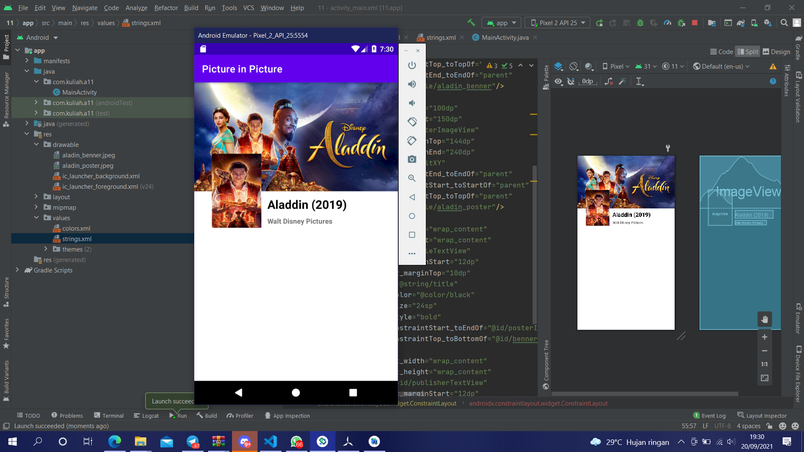

# 11 Constraint Layout - Picture in Picture

## Tujuan Pembelajaran

1. Mahasiswa tahu bagaimana menampilkan gambar dari image resources menggunakan imageview.

## Hasil Praktikum

Link menuju sumber : [Source](/../../tree/master/src/11$20Constraint$20Layout$20-$20Picture$20in$20Picture)