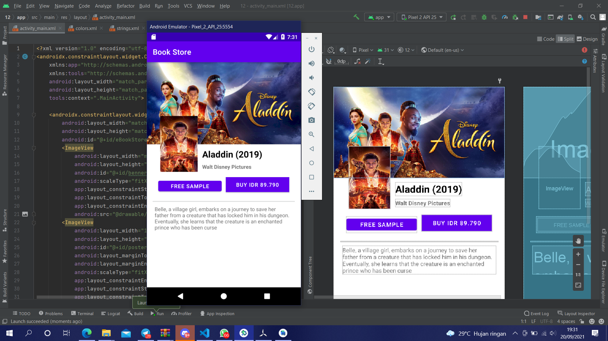

# 12 Constraint Layout - Modern E-Book Store

## Tujuan Pembelajaran

1. Mahasiswa mengetahui cara membuat halaman aplikasi toko buku elektroik modern.

## Hasil Praktikum

Link menuju sumber : [Source](/../../tree/master/src/12$20Constraint$20Layout$20-$20Modern$20E-Book$20Store)