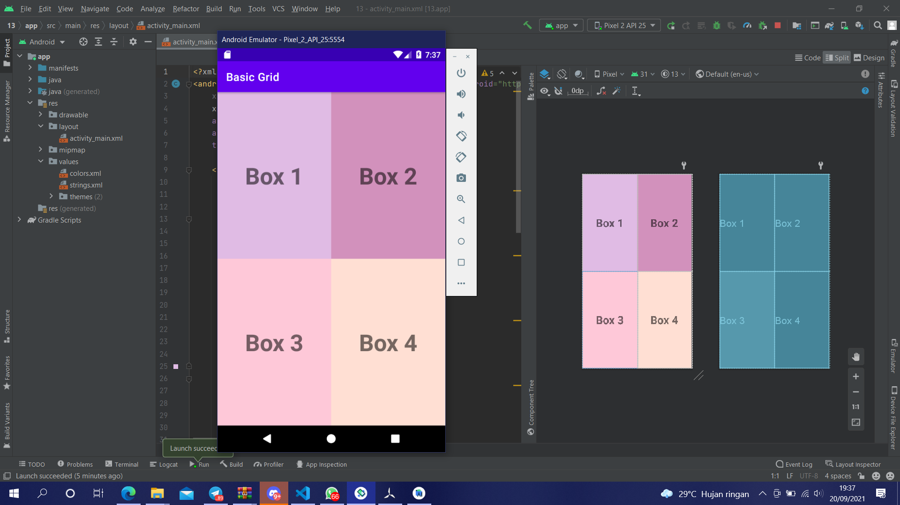

# 13 Grid Layout - Basic Layout

## Tujuan Pembelajaran

1. Mahasiswa mengetahui cara mengatur view pada grid layout.

## Hasil Praktikum

Link menuju sumber : [Source](/../../tree/master/src/13$20Grid$20Layout$20-$20Basic$20Layout)