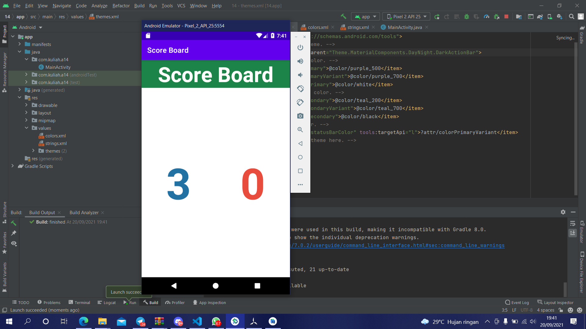

# 14 Grid Layout - Score Board

## Tujuan Pembelajaran

1. Mahasiswa mengetahui cara membuat papan skor dengan menggunakan grid layout.

## Hasil Praktikum

Link menuju sumber : [Source](/../../tree/master/src/14$20Grid$20Layout$20-$20Score$20Board)