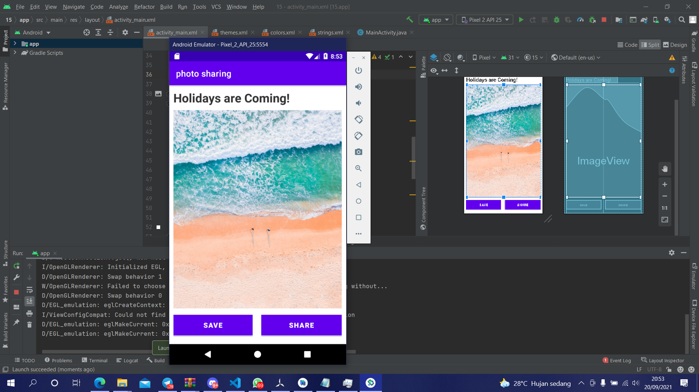

# 15 Grid Layout - Photo Sharing

## Tujuan Pembelajaran

1. Mahasiswa mengetahui cara membuat aplikasi berbagi foto dengan menggunakan grid layout.

## Hasil Praktikum

Link menuju sumber : [Source](/../../tree/master/src/15$20Grid$20Layout$20-$20Photo$20Sharing)